--------------------------------------------------------------------------------

- https://www.cnblogs.com/pony1223/p/8138233.html / 2017

--------------------------------------------------------------------------------

- _1_ - examples of direct buffer
- _2_ - examples of channel
- _3_ - examples of blocking nio
- _4_ - examples of non blocking nio
- _5_ - examples of pipe
- _6_ - examples of path

--------------------------------------------------------------------------------

# Execute all tests in repo

`/bin/bash run-repo-test.sh`

# JAVA NIO学习一：NIO简介、NIO&IO的主要区别

在前面学习了IO之后，今天我们开始进入NIO学习环节，首先我们会NIO做一个简单的介绍，让大家认识NIO，然后会和IO进行一个对比认识进行区分。好了，下面我们就开始学习：

## 一、NIO简介

### 1.概述

从JDK1.4开始，Java提供了一系列改进的输入/输出处理的新特性，被统称为NIO(即New I/O)。新增了许多用于处理输入输出的类，这些类都被放在java.nio包及子包下，并且对原java.io包中的很多类进行改写，新增了满足NIO的功能。NIO采用内存映射文件的方式来处理输入输出，NIO将文件或文件的一段区域映射到内存中，这样就可以像访问内存一样访问文件了。

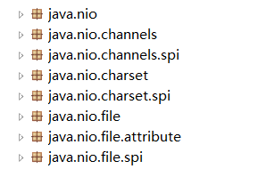

Java NIO（New IO） 是从Java 1.4版本开始引入的一个新的IO API，可以替代标准的Java IO API。NIO与原来的IO有同样的作用和目的，但是使用的方式完全不同， NIO支持面向缓冲区的、基于通道的IO操作。 NIO将以更加高效的方式进行文件的读写操作。

### 2.缓冲区Buffer

缓冲区实际上是一个容器对象，更直接的说，其实就是一个数组，在NIO库中，所有数据都是用缓冲区处理的。在读取数据时，它是直接读到缓冲区中的； 在写入数据时，它也是写入到缓冲区中的；任何时候访问 NIO 中的数据，都是将它放到缓冲区中。而在面向流I/O系统中，所有数据都是直接写入或者直接将数据读取到Stream对象中。具体看下面这张图就理解了：

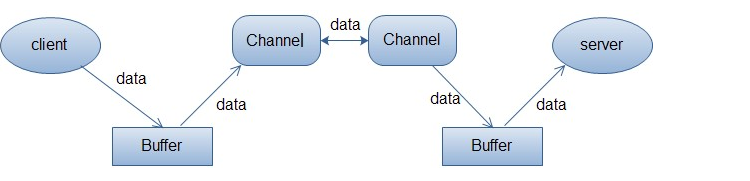

上面的图描述了从一个客户端向服务端发送数据，然后服务端接收数据的过程。客户端发送数据时，必须先将数据存入Buffer中，然后将Buffer中的内容写入通道。服务端这边接收数据必须通过Channel将数据读入到Buffer中，然后再从Buffer中取出数据来处理。

在NIO中，所有的缓冲区类型都继承于抽象类Buffer，最常用的就是ByteBuffer，对于Java中的基本类型，基本都有一个具体Buffer类型与之相对应，它们之间的继承关系如下图所示：

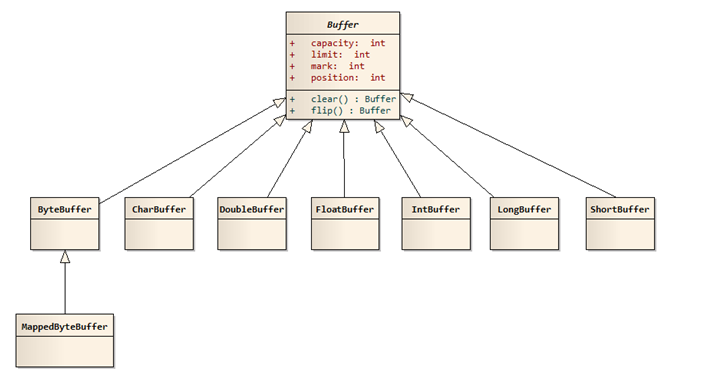

备注：可以看到出了Boolean 类型外，其它都有对应的Buffer.

### 3.通道Channel

Channel和传统IO中的Stream很相似。虽然很相似，但是有很大的区别，主要区别为：通道是双向的，通过一个Channel既可以进行读，也可以进行写；而Stream只能进行单向操作，通过一个Stream只能进行读或者写，比如InputStream只能进行读取操作，OutputStream只能进行写操作；
通道是一个对象，通过它可以读取和写入数据，当然了所有数据都通过Buffer对象来处理。我们永远不会将字节直接写入通道中，相反是将数据写入包含一个或者多个字节的缓冲区。同样不会直接从通道中读取字节，而是将数据从通道读入缓冲区，再从缓冲区获取这个字节。

比喻：通常我们把IO，比喻成为水流，管道就是水流的通道；NIO中，我们比喻为火车的轨道，然后缓冲区就是上面的火车。
在NIO中，提供了多种通道对象，而所有的通道对象都实现了Channel接口。它们之间的继承关系如下图所示：

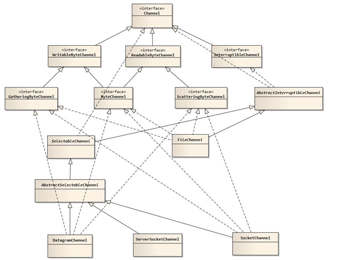

Channel(通道)表示到实体如硬件设备、文件、网络套接字或可以执行一个或多个不同I/O操作的程序组件的开放的连接。所有的Channel都不是通过构造器创建的，而是通过传统的节点InputStream、OutputStream的getChannel方法来返回响应的Channel。

Channel中最常用的三个类方法就是map、read和write，其中map方法用于将Channel对应的部分或全部数据映射成ByteBuffer，而read或write方法有一系列的重载形式，这些方法用于从Buffer中读取数据或向Buffer中写入数据。

### 4.选择器Selector

Selector类是NIO的核心类，Selector能够检测多个注册的通道上是否有事件发生，如果有事件发生，便获取事件然后针对每个事件进行相应的响应处理。这样一来，只是用一个单线程就可以管理多个通道，也就是管理多个连接。这样使得只有在连接真正有读写事件发生时，才会调用函数来进行读写，就大大地减少了系统开销，并且不必为每个连接都创建一个线程，不用去维护多个线程，并且避免了多线程之间的上下文切换导致的开销。

与Selector有关的一个关键类是SelectionKey，一个SelectionKey表示一个到达的事件，这2个类构成了服务端处理业务的关键逻辑。

## 二、NIO 和 IO 区别

### 1.概述

Java NIO提供了与标准IO不同的IO工作方式： 

- Channels and Buffers（通道和缓冲区）：标准的IO基于字节流和字符流进行操作的，而NIO是基于通道（Channel）和缓冲区（Buffer）进行操作，数据总是从通道读取到缓冲区中，或者从缓冲区写入到通道中。
- Asynchronous IO（异步IO）：Java NIO可以让你异步的使用IO，例如：当线程从通道读取数据到缓冲区时，线程还是可以进行其他事情。当数据被写入到缓冲区时，线程可以继续处理它。从缓冲区写入通道也类似。
- Selectors（选择器）：Java NIO引入了选择器的概念，选择器用于监听多个通道的事件（比如：连接打开，数据到达）。因此，单个的线程可以监听多个数据通道。

### 2.使用场景

NIO

- 优势在于一个线程管理多个通道；但是数据的处理将会变得复杂；
- 如果需要管理同时打开的成千上万个连接，这些连接每次只是发送少量的数据，采用这种；

传统的IO

- 适用于一个线程管理一个通道的情况；因为其中的流数据的读取是阻塞的；
- 如果需要管理同时打开不太多的连接，这些连接会发送大量的数据；

### 3.NIO VS IO

NIO vs IO之间的理念上面的区别（NIO将阻塞交给了后台线程执行

- IO是面向流的，NIO是面向缓冲区的
  - Java IO面向流意味着每次从流中读一个或多个字节，直至读取所有字节，它们没有被缓存在任何地方；
  - NIO则能前后移动流中的数据，因为是面向缓冲区的
- IO流是阻塞的，NIO流是不阻塞的
  - Java IO的各种流是阻塞的。这意味着，当一个线程调用read() 或 write()时，该线程被阻塞，直到有一些数据被读取，或数据完全写入。该线程在此期间不能再干任何事情了
  - Java NIO的非阻塞模式，使一个线程从某通道发送请求读取数据，但是它仅能得到目前可用的数据，如果目前没有数据可用时，就什么都不会获取。NIO可让您只使用一个（或几个）单线程管理多个通道（网络连接或文件），但付出的代价是解析数据可能会比从一个阻塞流中读取数据更复杂。 
  - 非阻塞写也是如此。一个线程请求写入一些数据到某通道，但不需要等待它完全写入，这个线程同时可以去做别的事情。
- 选择器
  - Java NIO的选择器允许一个单独的线程来监视多个输入通道，你可以注册多个通道使用一个选择器，然后使用一个单独的线程来“选择”通道：这些通道里已经有可以处理的输入，或者选择已准备写入的通道。这种选择机制，使得一个单独的线程很容易来管理多个通道。

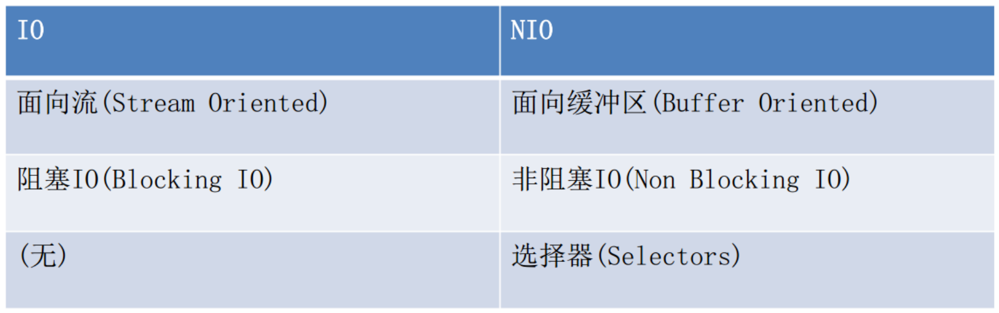

例子比喻：（http://blog.csdn.net/zhouhl_cn/article/details/6568119）

传统的socket IO中，需要为每个连接创建一个线程，当并发的连接数量非常巨大时，线程所占用的栈内存和CPU线程切换的开销将非常巨大。使用NIO，不再需要为每个线程创建单独的线程，可以用一个含有限数量线程的线程池，甚至一个线程来为任意数量的连接服务。由于线程数量小于连接数量，所以每个线程进行IO操作时就不能阻塞，如果阻塞的话，有些连接就得不到处理，NIO提供了这种非阻塞的能力。

小量的线程如何同时为大量连接服务呢，答案就是就绪选择。这就好比到餐厅吃饭，每来一桌客人，都有一个服务员专门为你服务，从你到餐厅到结帐走人，这样方式的好处是服务质量好，一对一的服务，VIP啊，可是缺点也很明显，成本高，如果餐厅生意好，同时来100桌客人，就需要100个服务员，那老板发工资的时候得心痛死了，这就是传统的一个连接一个线程的方式。

老板是什么人啊，精着呢。这老板就得捉摸怎么能用10个服务员同时为100桌客人服务呢，老板就发现，服务员在为客人服务的过程中并不是一直都忙着，客人点完菜，上完菜，吃着的这段时间，服务员就闲下来了，可是这个服务员还是被这桌客人占用着，不能为别的客人服务，用华为领导的话说，就是工作不饱满。那怎么把这段闲着的时间利用起来呢。这餐厅老板就想了一个办法，让一个服务员（前台）专门负责收集客人的需求，登记下来，比如有客人进来了、客人点菜了，客人要结帐了，都先记录下来按顺序排好。每个服务员到这里领一个需求，比如点菜，就拿着菜单帮客人点菜去了。点好菜以后，服务员马上回来，领取下一个需求，继续为别人客人服务去了。这种方式服务质量就不如一对一的服务了，当客人数据很多的时候可能需要等待。但好处也很明显，由于在客人正吃饭着的时候服务员不用闲着了，服务员这个时间内可以为其他客人服务了，原来10个服务员最多同时为10桌客人服务，现在可能为50桌，60客人服务了。

这种服务方式跟传统的区别有两个：

1、增加了一个角色，要有一个专门负责收集客人需求的人。NIO里对应的就是Selector。

2、由阻塞服务方式改为非阻塞服务了，客人吃着的时候服务员不用一直侯在客人旁边了。传统的IO操作，比如read()，当没有数据可读的时候，线程一直阻塞被占用，直到数据到来。NIO中没有数据可读时，read()会立即返回0，线程不会阻塞。

NIO中，客户端创建一个连接后，先要将连接注册到Selector，相当于客人进入餐厅后，告诉前台你要用餐，前台会告诉你你的桌号是几号，然后你就可能到那张桌子坐下了，SelectionKey就是桌号。当某一桌需要服务时，前台就记录哪一桌需要什么服务，比如1号桌要点菜，2号桌要结帐，服务员从前台取一条记录，根据记录提供服务，完了再来取下一条。这样服务的时间就被最有效的利用起来了。

# JAVA NIO学习二：通道（Channel）与缓冲区（Buffer）

今天是2018年的第三天，真是时光飞逝，2017年的学习计划还没有学习完成，因此继续开始研究学习，那么上一节我们了解了NIO，那么这一节我们进一步来学习NIO相关的知识。那就是通道和缓冲区。Java NIO系统的核心在于：通道(Channel)和缓冲区(Buffer)。通道表示打开到 IO 设备(例如：文件、套接字)的连接。若需要使用 NIO 系统，需要获取用于连接 IO 设备的通道以及用于容纳数据的缓冲区。然后操作缓冲区，对数据进行处理。简而言之， Channel 负责传输， Buffer 负责存储。

## 一、缓冲区（Buffer）

缓冲区（Buffer）:一个用于特定基本数据类型的容器。由 java.nio 包定义的，所有缓冲区都是 Buffer 抽象类的子类。Java NIO 中的 Buffer 主要用于与 NIO 通道进行交互，数据是从通道读入缓冲区，从缓冲区写入通道中的。

缓冲区对象本质上是一个数组，但它其实是一个特殊的数组，缓冲区对象内置了一些机制，能够跟踪和记录缓冲区的状态变化情况，如果我们使用get()方法从缓冲区获取数据或者使用put()方法把数据写入缓冲区，都会引起缓冲区状态的变化。它可以保存多个相同类型的数据。根据数据类型不同(boolean 除外) ，有以下 Buffer 常用子类：

- ByteBuffer
- CharBuffer
- ShortBuffer
- IntBuffer
- LongBuffer
- FloatBuffer
- DoubleBuffer

上述 Buffer 类 他们都采用相似的方法进行管理数据，只是各自管理的数据类型不同而已。都是通过如下方法获取一个 Buffer对象：
static XxxBuffer allocate(int capacity) : 创建一个容量为 capacity 的 XxxBuffer 对象

在缓冲区中，最重要的属性有下面三个，它们一起合作完成对缓冲区内部状态的变化跟踪：

position：指定了下一个将要被写入或者读取的元素索引，它的值由get()/put()方法自动更新，在新创建一个Buffer对象时，position被初始化为0。

limit：指定还有多少数据需要取出(在从缓冲区写入通道时)，或者还有多少空间可以放入数据(在从通道读入缓冲区时)。

capacity：指定了可以存储在缓冲区中的最大数据容量，实际上，它指定了底层数组的大小，或者至少是指定了准许我们使用的底层数组的容量。

另外：

标记 (mark)与重置 (reset)： 标记是一个索引，通过 Buffer 中的 mark() 方法指定 Buffer 中一个特定的 position，之后可以通过调用 reset() 方法恢复到这个 position.

以上四个属性值之间有一些相对大小的关系：0 <= position <= limit <= capacity。如果我们创建一个新的容量大小为10的ByteBuffer对象，在初始化的时候，position设置为0，limit和 capacity被设置为10，在以后使用ByteBuffer对象过程中，capacity的值不会再发生变化，而其它两个个将会随着使用而变化。四个属性值分别如图所示：

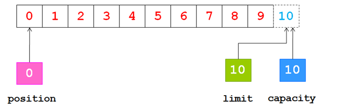


现在我们可以从通道中读取一些数据到缓冲区中，注意从通道读取数据，相当于往缓冲区中写入数据。如果读取4个自己的数据，则此时position的值为4，即下一个将要被写入的字节索引为4，而limit仍然是10，如下图所示：


下一步把读取的数据写入到输出通道中，相当于从缓冲区中读取数据，在此之前，必须调用flip()方法，该方法将会完成两件事情：

1. 把limit设置为当前的position值 
2. 把position设置为0

由于position被设置为0，所以可以保证在下一步输出时读取到的是缓冲区中的第一个字节，而limit被设置为当前的position，可以保证读取的数据正好是之前写入到缓冲区中的数据，如下图所示：

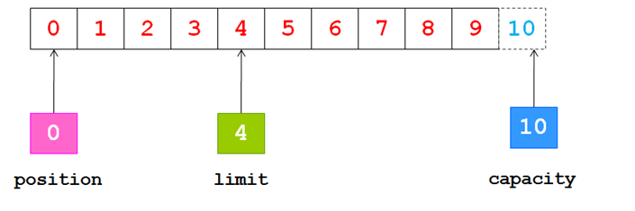

现在调用get()方法从缓冲区中读取数据写入到输出通道，这会导致position的增加而limit保持不变，但position不会超过limit的值，所以在读取我们之前写入到缓冲区中的4个自己之后，position和limit的值都为4，如下图所示：

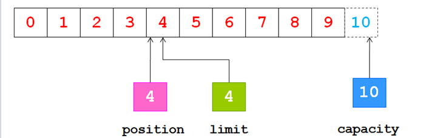

在从缓冲区中读取数据完毕后，limit的值仍然保持在我们调用flip()方法时的值，调用clear()方法能够把所有的状态变化设置为初始化时的值，如下图所示

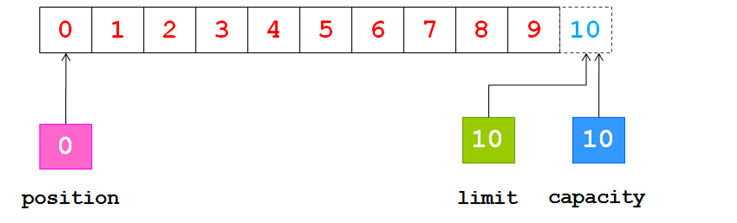

### Buffer 的常用方法：

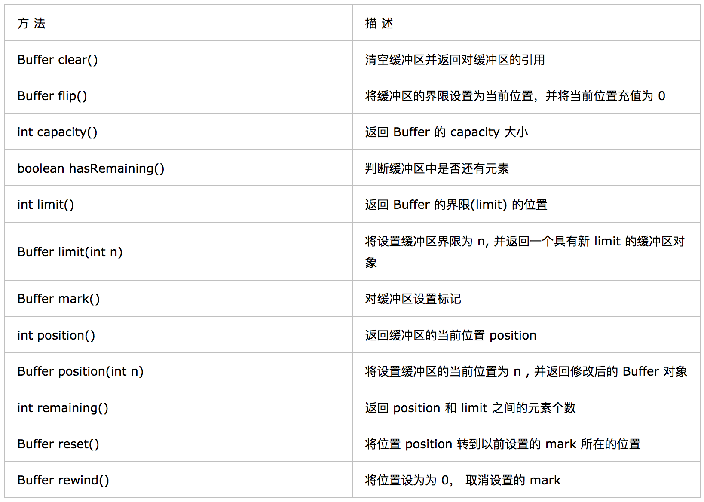

### 缓冲区的数据操作
Buffer 所有子类提供了两个用于数据操作的方法： get()与 put() 方法

获取 Buffer 中的数据
- get() ：读取单个字节
- get(byte[] dst)：批量读取多个字节到 dst 中
- get(int index)：读取指定索引位置的字节(不会移动 position)

放入数据到 Buffer 中
- put(byte b)：将给定单个字节写入缓冲区的当前位置
- put(byte[] src)：将 src 中的字节写入缓冲区的当前位置
- put(int index, byte b)：将指定字节写入缓冲区的索引位置(不会移动 position)

### 直接与非直接缓冲区

字节缓冲区要么是直接的，要么是非直接的。如果为直接字节缓冲区，则 Java 虚拟机会尽最大努力直接在此缓冲区上执行本机 I/O 操作。也就是说，在每次调用基础操作系统的一个本机 I/O 操作之前（或之后），虚拟机都会尽量避免将缓冲区的内容复制到中间缓冲区中（或从中间缓冲区中复制内容）。

直接字节缓冲区可以通过调用此类的 allocateDirect() 工厂方法来创建。此方法返回的缓冲区进行分配和取消分配所需成本通常高于非直接缓冲区。直接缓冲区的内容可以驻留在常规的垃圾回收堆之外，因此，它们对应用程序的内存需求量造成的影响可能并不明显。所以，建议将直接缓冲区主要分配给那些易受基础系统的本机 I/O 操作影响的大型、持久的缓冲区。一般情况下，最好仅在直接缓冲区能在程序性能方面带来明显好处时分配它们。直接字节缓冲区还可以通过 FileChannel 的 map() 方法 将文件区域直接映射到内存中来创建。该方法返回MappedByteBuffer 。 Java 平台的实现有助于通过 JNI 从本机代码创建直接字节缓冲区。如果以上这些缓冲区中的某个缓冲区实例指的是不可访问的内存区域，则试图访问该区域不会更改该缓冲区的内容，并且将会在访问期间或稍后的某个时间导致抛出不确定的异常。

字节缓冲区是直接缓冲区还是非直接缓冲区可通过调用其 isDirect() 方法来确定。提供此方法是为了能够在性能关键型代码中执行显式缓冲区管理。

非直接缓冲区

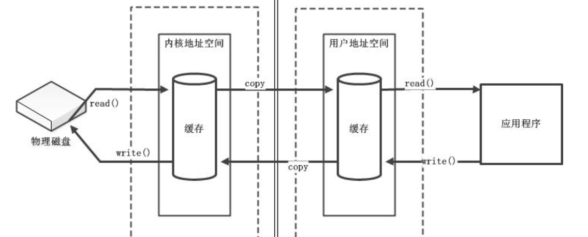

直接缓冲区

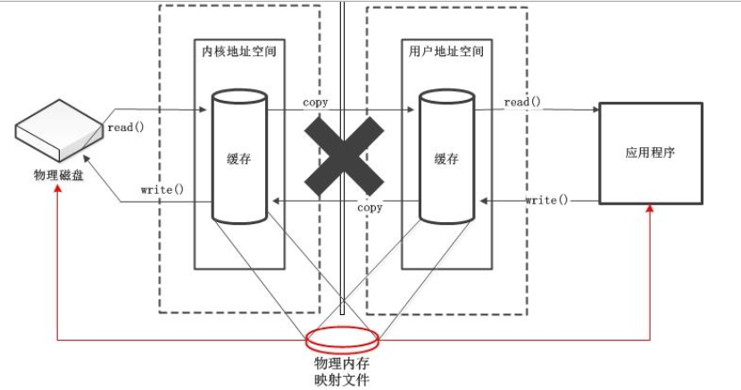

下面我们看下直接缓冲区的操作样例和重点：

[_1_DirectBufferTest.java](/src/test/java/core/java/nio/based/on/pony1223/_1_DirectBufferTest.java)


## 二、通道（Channel）

通道（Channel）：由 java.nio.channels 包定义的。 Channel 表示 IO 源与目标打开的连接。Channel 类似于传统的“流”。只不过 Channel本身不能直接访问数据， Channel 只能与Buffer 进行交互。

下面我们通过几张图来引入通道：
 
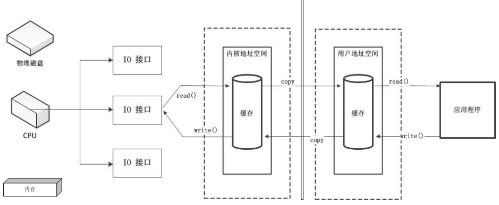

上面这张图是指当准备从磁盘或内存中copy数据，进行IO操作的时候，需要建立IO 连接，那么这个时候所有的调度中心都在CPU上面，那么当有很多IO请求的时候，那么CPU都要直接参与调度，那么势必会影响到CPU的执行效率，因为所有的IO从建立连接到传入数据都要经过CPU的操作来完成，于是为了节省CPU的占用率，于是出现了下面的改进；


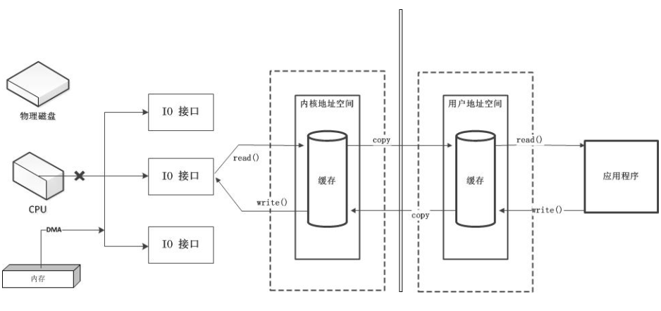

这种是CPU将权利释放，只是进行审批流程，即就相当于我们现实生活工作中，领导不负责具体的工作，只负责签字审批确认即可，那么就减少了IO对CPU的影响，从而提高了CPU的利用率，但这种还是会占用到CPU的时间消耗和利用率，因此为了完全不占用CPU，于是出现了专门负责IO的专门者，就是通道：

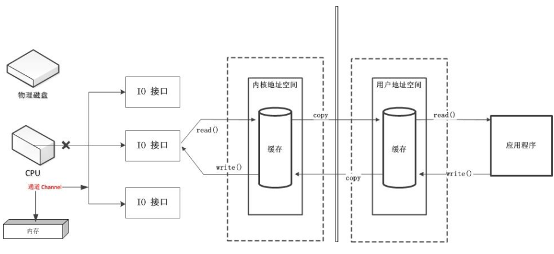

Java 为 Channel 接口提供的最主要实现类如下：
- FileChannel：用于读取、写入、映射和操作文件的通道。
- DatagramChannel：通过 UDP 读写网络中的数据通道。
- SocketChannel：通过 TCP 读写网络中的数据。
- ServerSocketChannel：可以监听新进来的 TCP 连接，对每一个新进来的连接都会创建一个 SocketChannel。

### 获取通道

获取通道的一种方式是对支持通道的对象调用getChannel() 方法。支持通道的类如下：
- FileInputStream
- FileOutputStream
- RandomAccessFile
- DatagramSocket
- Socket
- ServerSocket
获取通道的其他方式是使用 Files 类的静态方法 newByteChannel() 获取字节通道。或者通过通道的静态方法 open() 打开并返回指定通道。

### 通道的数据传输

将 Buffer 中数据写入 Channel

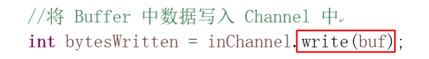

从 Channel 读取数据到 Buffer

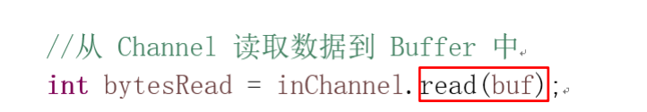

### 分散(Scatter)和聚集(Gather)

分散读取（Scattering Reads）是指从 Channel 中读取的数据“分散” 到多个 Buffer 中

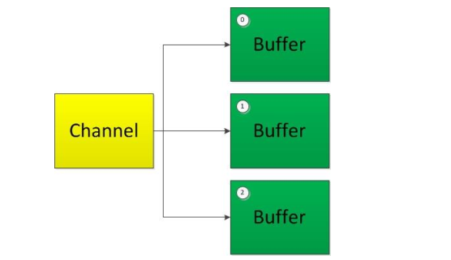

注意：按照缓冲区的顺序，从 Channel 中读取的数据依次将 Buffer 填满。

聚集写入（Gathering Writes）是指将多个 Buffer 中的数据“聚集”到 Channel。

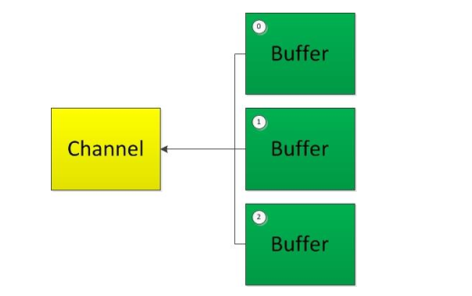

注意：按照缓冲区的顺序，写入 position 和 limit 之间的数据到 Channel 。

### transferFrom()

将数据从源通道传输到其他 Channel 中

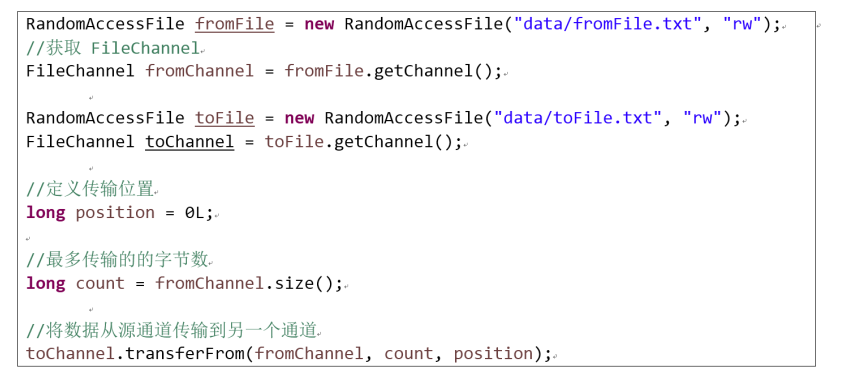

### transferTo()

将数据从源通道传输到其他 Channel 中

### FileChannel 的常用方法

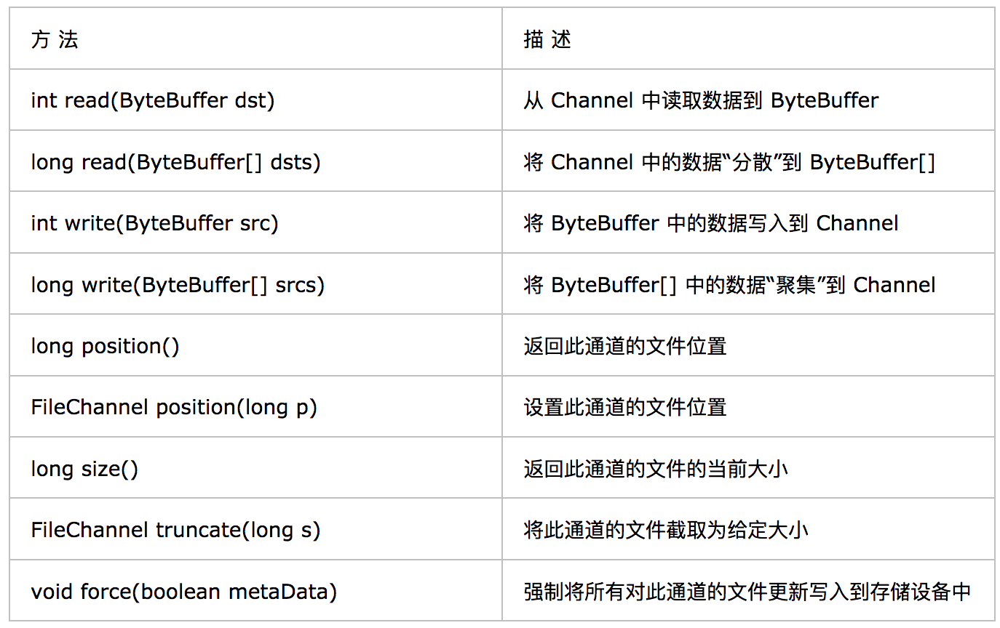

上述样例代码和核心

[_2_ChannelTest.java](/src/test/java/core/java/nio/based/on/pony1223/_2_ChannelTest.java)

# JAVA NIO学习三：NIO 的非阻塞式网络通信

紧接着上一章，我们继续来研究NIO，上一章中我们讲了NIO 中最常见的操作即文件通道的操作，但实际上NIO的主要用途还是在于网络通信，那么这个时候就会涉及到选择器，这一章我们就会对其进行讲解操作。

## 一、阻塞和非阻塞

传统的 IO 流都是阻塞式的。也就是说，当一个线程调用 read() 或 write()时，该线程被阻塞，直到有一些数据被读取或写入，该线程在此期间不能执行其他任务。因此，在完成网络通信进行 IO 操作时，由于线程会阻塞，所以服务器端必须为每个客户端都提供一个独立的线程进行处理，当服务器端需要处理大量客户端时，性能急剧下降。
Java NIO 是非阻塞模式的。当线程从某通道进行读写数据时，若没有数据可用时，该线程可以进行其他任务。线程通常将非阻塞 IO 的空闲时间用于在其他通道上执行 IO 操作，所以单独的线程可以管理多个输入和输出通道。因此， NIO 可以让服务器端使用一个或有限几个线程来同时处理连接到服务器端的所有客户端。

下面我看个例子来使用NIO 演示下阻塞式，即不采用选择器情况下：

[_3_1_BlockingNioNoSelectorTest](/src/test/java/core/java/nio/based/on/pony1223/_3_1_BlockingNioNoSelectorTest.java)


那么解决上面的方法，以前没有选择器的时候，对于阻塞情况，我们可以采用下面的方法：（发送完成，自动自己关闭告知已发送完成）

[_3_2_BlockingNioNoSelectorWithFeedbackFromServerTest.java](/src/test/java/core/java/nio/based/on/pony1223/_3_2_BlockingNioNoSelectorWithFeedbackFromServerTest.java)

## 二、选择器（Selector）

选择器（Selector） 是 SelectableChannle 对象的多路复用器， Selector 可以同时监控多个 SelectableChannel 的 IO 状况，也就是说，**利用 Selector可使一个单独的线程管理多个 Channel**。

**Selector 是非阻塞 IO 的核心**。

SelectableChannle 的结构如下图：

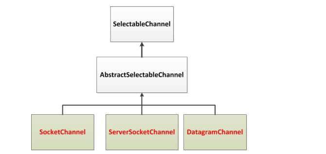

### 选择器（Selector）的应用

创建 Selector ：通过调用 Selector.open() 方法创建一个 Selector。 


向选择器注册通道： SelectableChannel.register(Selector sel, int ops) 

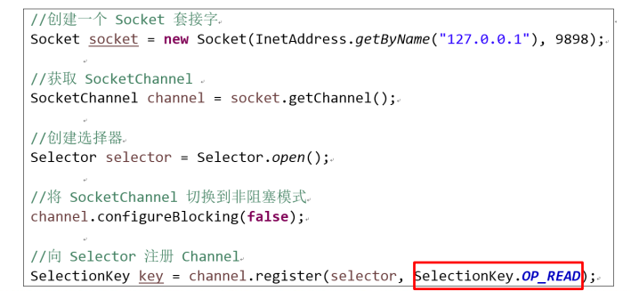
 
当调用 register(Selector sel, int ops) 将通道注册选择器时，选择器对通道的监听事件，需要通过第二个参数 ops 指定。
可以监听的事件类型（可使用 SelectionKey 的四个常量表示）：

- 读 : SelectionKey.OP_READ （1）
- 写 : SelectionKey.OP_WRITE （4）
- 连接 : SelectionKey.OP_CONNECT （8）
- 接收 : SelectionKey.OP_ACCEPT （16）
若注册时不止监听一个事件，则可以使用“位或”操作符连接

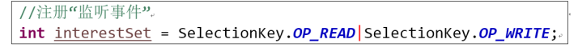

### SelectionKey

SelectionKey： 表示 SelectableChannel 和 Selector 之间的注册关系。每次向选择器注册通道时就会选择一个事件(选择键)。 选择键包含两个表示为整数值的操作集。操作集的每一位都表示该键的通道所支持的一类可选择操作 。

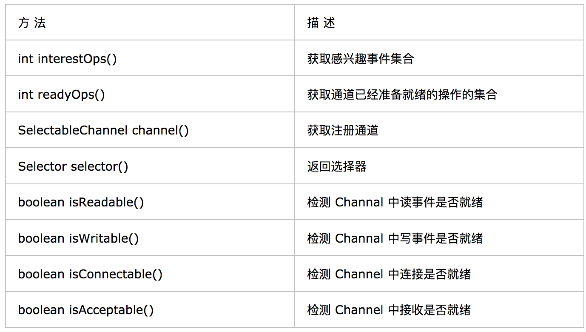

### Selector 的常用方法

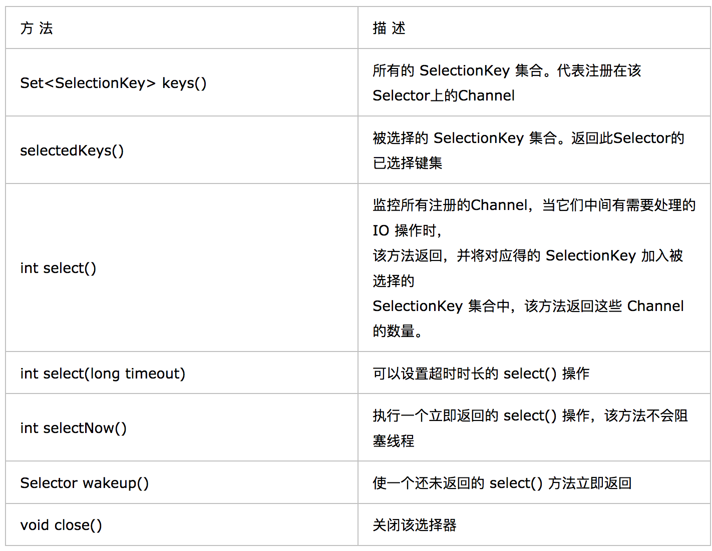

### SocketChannel

Java NIO中的SocketChannel是一个连接到TCP网络套接字的通道。
操作步骤：

- 打开 SocketChannel
- 读写数据
- 关闭 SocketChannel

Java NIO中的 ServerSocketChannel 是一个可以监听新进来的TCP连接的通道，就像标准IO中的ServerSocket一样

代码样例；

[_4_1_NonBlockingNioSocketChannelTest.java](/src/test/java/core/java/nio/based/on/pony1223/_4_1_NonBlockingNioSocketChannelTest.java)

### DatagramChannel

Java NIO中的DatagramChannel是一个能收发UDP包的通道。
 操作步骤：

- 打开 DatagramChannel
- 接收/发送数据

[_4_2_NonBlockingNioDatagramChannelTest.java](/src/test/java/core/java/nio/based/on/pony1223/_4_2_NonBlockingNioDatagramChannelTest.java)

### 管道 (Pipe)

Java NIO 管道是2个线程之间的单向数据连接。Pipe有一个source通道和一个sink通道。数据会被写到sink通道，从source通道读取。

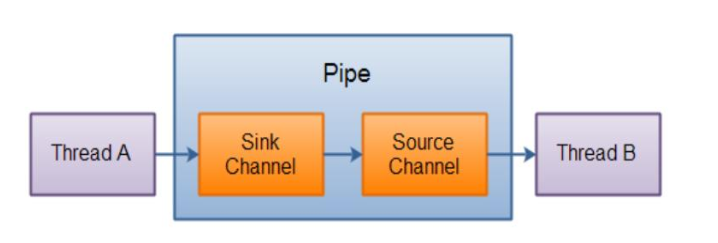

#### 向管道写数据

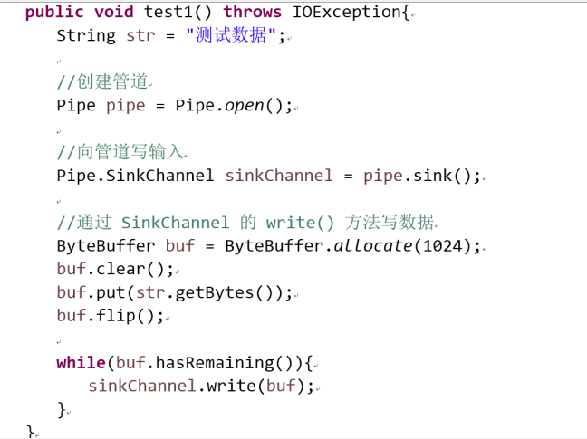

#### 从管道读取数据 

从读取管道的数据，需要访问source通道

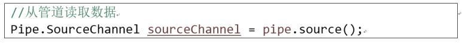

调用source通道的read()方法来读取数据 

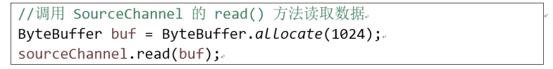

代码样例

[_5_PipeTest.java](/src/test/java/core/java/nio/based/on/pony1223/_5_PipeTest.java)

# JAVA NIO学习四：Path&Paths&Files 学习

今天我们将学习NIO 的最后一章，前面大部分涉及IO 和 NIO 的知识都已经讲过了，那么本章将要讲解的是关于Path 以及Paths 和 Files 相关的知识点，以对前面知识点的补充，好了言归正传吧。随着 JDK 7 的发布,Java对NIO进行了极大的扩展,增强了对文件处理和文件系统特性的支持,以至于我们称他们为 NIO.2。因为 NIO 提供的一些功能， NIO已经成为文件处理中越来越重要的部分。

## 一、Path 与 Paths

java.nio.file.Path 接口代表一个平台无关的平台路径，描述了目录结构中文件的位置。

Paths 提供的 get() 方法用来获取 Path 对象：
- Path get(String first, String … more) : 用于将多个字符串串连成路径。

Path 常用方法：
- boolean endsWith(String path) : 判断是否以 path 路径结束
- boolean startsWith(String path) : 判断是否以 path 路径开始
- boolean isAbsolute() : 判断是否是绝对路径
- Path getFileName() : 返回与调用 Path 对象关联的文件名
- Path getName(int idx) : 返回的指定索引位置 idx 的路径名称
- int getNameCount() : 返回Path 根目录后面元素的数量
- Path getParent() ：返回Path对象包含整个路径，不包含 Path 对象指定的文件路径
- Path getRoot() ：返回调用 Path 对象的根路径
- Path resolve(Path p) :将相对路径解析为绝对路径
- Path toAbsolutePath() : 作为绝对路径返回调用 Path 对象
- String toString() ： 返回调用 Path 对象的字符串表示形式

## 二、Files 类

java.nio.file.Files 用于操作文件或目录的工具类。

Files常用方法：
- Path copy(Path src, Path dest, CopyOption … how) : 文件的复制
- Path createDirectory(Path path, FileAttribute<?> … attr) : 创建一个目录
- Path createFile(Path path, FileAttribute<?> … arr) : 创建一个文件
- void delete(Path path) : 删除一个文件
- Path move(Path src, Path dest, CopyOption…how) : 将 src 移动到 dest 位置
- long size(Path path) : 返回 path 指定文件的大小

Files常用方法：用于判断
- boolean exists(Path path, LinkOption … opts) : 判断文件是否存在
- boolean isDirectory(Path path, LinkOption … opts) : 判断是否是目录
- boolean isExecutable(Path path) : 判断是否是可执行文件
- boolean isHidden(Path path) : 判断是否是隐藏文件
- boolean isReadable(Path path) : 判断文件是否可读
- boolean isWritable(Path path) : 判断文件是否可写
- boolean notExists(Path path, LinkOption … opts) : 判断文件是否不存在
- public static <A extends BasicFileAttributes> A readAttributes(Path path,Class<A> type,LinkOption...
options) : 获取与 path 指定的文件相关联的属性。

Files常用方法： 用于操作内容
- SeekableByteChannel newByteChannel(Path path, OpenOption…how) : 获取与指定文件的连接，how 指定打开方式。
- DirectoryStream newDirectoryStream(Path path) : 打开 path 指定的目录
- InputStream newInputStream(Path path, OpenOption…how):获取 InputStream 对象
- OutputStream newOutputStream(Path path, OpenOption…how) : 获取 OutputStream 对象

## 三、自动资源管理

Java 7 增加了一个新特性，该特性提供了另外一种管理资源的方式，这种方式能自动关闭文件。这个特性有时被称为自动资源管理(Automatic Resource Management, ARM)， 该特性以 try 语句的扩展版为基础。自动资源管理主要用于，当不再需要文件（或其他资源）时，可以防止无意中忘记释放它们。

自动资源管理基于 try 语句的扩展形式：
```java
try(需要关闭的资源声明){
  //可能发生异常的语句
} catch(异常类型 变量名){
  //异常的处理语句
} finally{
  //一定执行的语句
} 
```
当
try 代码块结束时，自动释放资源。因此不需要显示的调用 close() 方法。该形式也称为“带资源的 try 语句” 。
注意：

1. try 语句中声明的资源被隐式声明为 final ，资源的作用局限于带资源的 try 语句
2. 可以在一条 try 语句中管理多个资源，每个资源以“;” 隔开即可。
3. 需要关闭的资源，必须实现了 AutoCloseable 接口或其自接口 Closeable

上述代码样例如下：

[_6_PathAndPathsAndFilesTest.java](/src/test/java/core/java/nio/based/on/pony1223/_6_PathAndPathsAndFilesTest.java)
